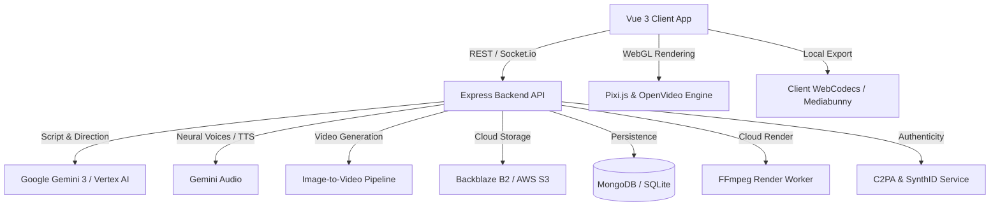

#  Shine — AI Micro-Drama Video Studio

<p align="center">
  <strong>Next-Generation End-to-End AI Micro-Drama Creation Platform</strong><br>
  Transform prompts into viral vertical video dramas (9:16) with scriptwriting agents, character consistency, neural voice acting, dynamic kinetic captions, multi-language dubbing, and a professional multi-track WebGL editor.
</p>

<p align="center">
  <a href="#-key-features">Features</a> •
  <a href="#-architecture--tech-stack">Tech Stack</a> •
  <a href="#-pipeline-workflow-b1--b10">Pipeline</a> •
  <a href="#-getting-started">Getting Started</a> •
  <a href="#-environment-variables">Configuration</a> •
  <a href="#-project-structure">Project Structure</a> •
  <a href="#-license">License</a>
</p>

---

## 🌟 Overview

**Shine** is a vertical short-form video creation suite engineered specifically for the explosive micro-drama format (TikTok, YouTube Shorts, Instagram Reels, Kuaishou). It unifies AI generative pipelines with a non-linear multi-track timeline editor powered by **Pixi.js** and the **OpenVideo Engine**, enabling creators to produce multi-episode series in minutes.

---

## ✨ Key Features

### 🎭 1. AI Director & Master Scriptwriting
- **Automated Series Architect**: Generate complete 10–50 episode drama arcs with cliffhangers, conflict escalation, and character backstory.
- **Scene-by-Scene Breakdown**: Generates precise scene headers, actions, visual descriptions, camera instructions, and character dialogues.

### 👥 2. Character Consistency & Persona Engine
- **Visual Identity Preservation**: Generates character reference sheets and avatars for consistent appearances across episodes.
- **LoRA / Prompt DNA**: Automatic prompt injection ensures visual continuity for all cast members.

### 🎙️ 3. Multi-Language Neural Voiceover & Dubbing
- **Multi-Speaker TTS**: Assign distinct AI voices to each character with granular control over intensity, pacing, emotion, and pitch.
- **Multi-Language Tracks**: Create separate voice tracks (`vi-VN`, `en-US`, `zh-CN`, `ja-JP`, `ko-KR`) for global distribution.
- **AI Dubbing Re-alignment**: Automatic syllable density time-expansion adjustment to align dubbed audio with scene visuals.

### 📝 4. Kinetic Subtitles & Translation
- **Word-Level Kinetic Timing**: Auto-generates viral pop-in, bounce, and glowing subtitle animations.
- **One-Click Multi-Language Translation**: AI-powered translation of subtitle cues while preserving micro-drama timing and tone.

### 🎞️ 5. Scene-to-Video Generation
- **Image-to-Video Engine**: Transform storyboard scene backgrounds into cinematic video clips with camera movement (dolly, pan, zoom).
- **Smart Batch Rendering**: Intelligently skips already-rendered assets to optimize generation cost and speed.

### 🎛️ 6. OpenVideo Multi-Track WebGL Timeline
- **Non-Linear Editing**: Video, image, voiceover, BGM, SFX, captions, and transition tracks.
- **Interactive Canvas**: Real-time PIXI-accelerated preview, clip splitting, trimming, layering, and property manipulation.
- **Auto-Ducking & Soundscapes**: Intelligent background music volume ducking during dialogue.

### 🚀 7. Dual-Mode Render & Export (B8)
- **Local In-Browser Render**: Zero-server-cost fast client rendering via WebCodecs (`mediabunny` / `ExportModal`).
- **Cloud Server Queue**: Scalable background rendering via FFmpeg for high-resolution distribution bundles.
- **Post-Render Review**: In-app video preview player with instant download and direct publishing triggers.

### 🛡️ 8. AI Watermarking & Provenance
- **Google SynthID Integration**: Digital audio/video watermarking.
- **C2PA / Content Credentials**: Cryptographic provenance tracking for AI-generated media authenticity.

---

## 🏗 Architecture & Tech Stack



| Layer | Technologies |
|---|---|
| **Frontend Framework** | [Vue 3](https://vuejs.org/) (Composition API, `<script setup>`), [TypeScript](https://www.typescriptlang.org/) |
| **Build Tool** | [Vite 7](https://vitejs.dev/), [pnpm](https://pnpm.io/) |
| **UI & Styling** | [Element Plus](https://element-plus.org/), [TailwindCSS v4](https://tailwindcss.com/), [UnoCSS](https://unocss.dev/), Tabler & Lucide Icons |
| **Video & Canvas Engine** | [`@openvideo/core`](https://openvideo.dev/), `@openvideo/engine-pixi`, `@openvideo/timeline`, [Pixi.js v8](https://pixijs.com/) |
| **State Management** | [Pinia](https://pinia.vuejs.org/), VueUse |
| **Internationalization** | [Vue I18n](https://vue-i18n.intlify.dev/) (EN, VI, ZH, JA, KO) |
| **Backend API** | [Node.js](https://nodejs.org/), [Express](https://expressjs.com/), [Socket.io](https://socket.io/) |
| **Database** | [MongoDB](https://www.mongodb.com/) (`mongoose`) / SQLite (`better-sqlite3`) |
| **Media Processing** | [FFmpeg](https://ffmpeg.org/) (`fluent-ffmpeg`), [Mediabunny](https://github.com/) |
| **AI Services** | Google Gemini (`@google/genai`), Vertex AI, SynthID |
| **Observability** | [OpenTelemetry](https://opentelemetry.io/) traces & metrics |

---

## 🔄 Pipeline Workflow (B1 – B10)

```
[B1: Storyboards] ➔ [B2: Characters] ➔ [B3: Image2Video] ➔ [B4: Multi-Lang Voiceover]
       ➔ [B5: Scene BGM] ➔ [B6: Kinetic Captions] ➔ [B7: WebGL Preview]
              ➔ [B8: Dual Export] ➔ [B9: Auto-Save] ➔ [B10: Multi-Publish]
```

1. **B1: Storyboard Backgrounds** — Generates initial 9:16 scene visual concepts.
2. **B2: Consistent Cast** — Generates and locks character avatars and visual prompts.
3. **B3: Scene Image-to-Video** — Converts storyboard scenes into motion video clips.
4. **B4: Neural Voiceover (TTS)** — Synthesizes multi-speaker dialogue per language track.
5. **B5: Dynamic BGM & SFX** — Matches scene tone with mood-based background audio tracks.
6. **B6: Kinetic Captions** — Generates word-level animated subtitles with translation capabilities.
7. **B7: Interactive Timeline Preview** — Synchronizes all assets into the OpenVideo canvas editor.
8. **B8: Dual-Mode Export** — Fast local browser render or high-performance server job queue.
9. **B9: Auto-Save & State Sync** — Automatically persists timeline state, scenes, and language tracks.
10. **B10: Multi-Platform Publish** — Prepares and packages exports for TikTok, YouTube Shorts, and Reels.

---

## 🚀 Getting Started

### Prerequisites

- **Node.js**: `v20.x` or higher
- **Package Manager**: `pnpm` (`v9.x` or `v10.x`)
- **FFmpeg**: (Optional for server rendering) Installed and available in your `PATH`

### 1. Clone the Repository

```bash
git clone https://github.com/agrhub/shine.git
cd shine
```

### 2. Install Dependencies

```bash
pnpm install
```

### 3. Setup Environment Variables

Copy the example configuration file:

```bash
cp .env.example .env
```

Edit `.env` with your API credentials (see [Configuration](#-environment-variables) below).

### 4. Run in Development Mode

Run both client and server concurrently:

```bash
pnpm run dev
```

- **Client Application**: [http://localhost:3000](http://localhost:3000) (or assigned Vite port)
- **Backend API**: [http://localhost:3000](http://localhost:3000)

---

## ⚙️ Environment Variables

Configure these variables in your root `.env` file (see [`.env.example`](./.env.example) for reference):

```env
# --- Database Configuration ---
DB_PROVIDER="mongodb" # "mongodb" | "sqlite"
MONGODB_URI="mongodb+srv://<username>:<password>@<cluster>.mongodb.net/shine?retryWrites=true&w=majority"

# --- Google AI & Vertex AI Model Configuration ---
GEMINI_MODEL_TEXT_ANALYSIS="gemini-3.1-flash-lite"
GEMINI_MODEL_IMAGE_GENERATION="gemini-3.1-flash-lite-image"
GEMINI_MODEL_VIDEO_GENERATION="veo-3.1-generate-001"
GEMINI_MODEL_TTS="gemini-3.1-flash-tts-preview"
GEMINI_MODEL_VOICE="gemini-live-2.5-flash-native-audio"
GEMINI_MODEL_MUSIC="lyria-3-clip-preview"
GEMINI_MODEL_AGENT="gemini-3.1-flash-lite"

# --- Google Cloud Platform / Vertex AI Credentials ---
GOOGLE_CLOUD_PROJECT="your_gcp_project_id"
GOOGLE_CLOUD_LOCATION="global"
GOOGLE_GENAI_USE_VERTEXAI=1
GOOGLE_APPLICATION_CREDENTIALS="gcp-service-account.json"
# Standalone Google AI Studio API Key (optional fallback):
# GOOGLE_API_KEY="your_google_ai_studio_api_key_here"

# --- Storage Provider (Backblaze B2 / AWS S3) ---
STORAGE_PROVIDER="b2" # "b2" | "s3"
S3_BUCKET_NAME="your_s3_bucket_name"
S3_ACCESS_KEY="your_s3_access_key"
S3_SECRET_KEY="your_s3_secret_key"
S3_ACCOUNT_ID=""
S3_PUBLIC_DOMAIN=""
S3_REGION="us-east-005"
S3_ENDPOINT="https://s3.us-east-005.backblazeb2.com"

# --- Speech & Voiceover APIs ---
DEEPGRAM_URL="https://api.deepgram.com/v1"
DEEPGRAM_API_KEY="your_deepgram_api_key_here"
DEEPGRAM_MODEL="nova-3"

# --- Stock Media (Pexels) ---
PEXELS_URL="https://api.pexels.com"
PEXELS_API_KEY="your_pexels_api_key_here"

# --- Parallel & Task MCP ---
PARALLEL_API_KEY="your_parallel_api_key_here"
PARALLEL_MCP_SERVER="https://task-mcp.parallel.ai/mcp"

# --- Grafana & Observability ---
GRAFANA_MCP_ENDPOINT="https://mcp.grafana.com/mcp"
GRAFANA_URL="https://your-org.grafana.net"
GRAFANA_API_KEY="your_grafana_api_key_here"

# --- SMTP Email Notifications ---
SMTP_HOST="smtp.yourdomain.com"
SMTP_PORT=465
SMTP_SECURE="true"
SMTP_USER="notifications@yourdomain.com"
SMTP_PASS="your_smtp_app_password"
SMTP_NAME="Shine Studio"
ADMIN_EMAIL="admin@yourdomain.com"
```

---

## 📁 Project Structure

```
shine/
├── client/                     # Vue 3 Frontend Application
│   ├── src/
│   │   ├── components/         # Modals, Editor UI, CanvasPanel, Timeline
│   │   │   ├── editor/         # Timeline tracks, Header, MediaPanel, ExportModal
│   │   │   └── modals/         # MasterScript, CharacterPersona, ManageCast
│   │   ├── composables/        # useStudioStore, usePlaybackStore, useExport
│   │   ├── pages/              # ProjectWorkspacePage, SeriesPage, Analytics
│   │   │   └── projects/workspace/ # PipelineTab, ScriptTab, AudioTab, CaptionsTab
│   │   ├── stores/             # Pinia stores (useSeriesStore, usePipelineStore, etc.)
│   │   ├── locales/            # i18n translation bundles (en, vi, zh, ja, ko)
│   │   └── lib/                # OpenVideo core wrapper & PIXI engine bindings
│   └── vite.config.ts
│
├── server/                     # Express Backend Application
│   ├── src/
│   │   ├── agents/             # AI Pipeline Agents (MasterPlan, Character, Video)
│   │   ├── routes/             # REST Endpoints (series, voices, captions, render, etc.)
│   │   ├── database/           # MongoDB & SQLite providers
│   │   ├── integrations/       # GeminiClient, SynthID, StorageFactory
│   │   └── services/           # RenderService, TrendService, C2PA
│   └── tsconfig.json
│
├── docs/                       # Technical architecture, guides, & API documents
├── scripts/                    # Build & i18n synchronization utilities
├── package.json
└── README.md
```

---

## 📜 Available Scripts

| Command | Description |
|---|---|
| `pnpm run dev` | Runs both backend and frontend in development mode |
| `pnpm run client` | Starts Vite client dev server only |
| `pnpm run server` | Starts Express backend in tsx watch mode |
| `pnpm run build` | Builds client production bundle and compiles server |
| `pnpm run client:build` | Compiles client Vue/Vite application |
| `pnpm run server:build` | Compiles server TypeScript application |
| `pnpm run start` | Runs the compiled production server |

---

## 📄 License

This project is licensed under the [AGPL License](LICENSE).
