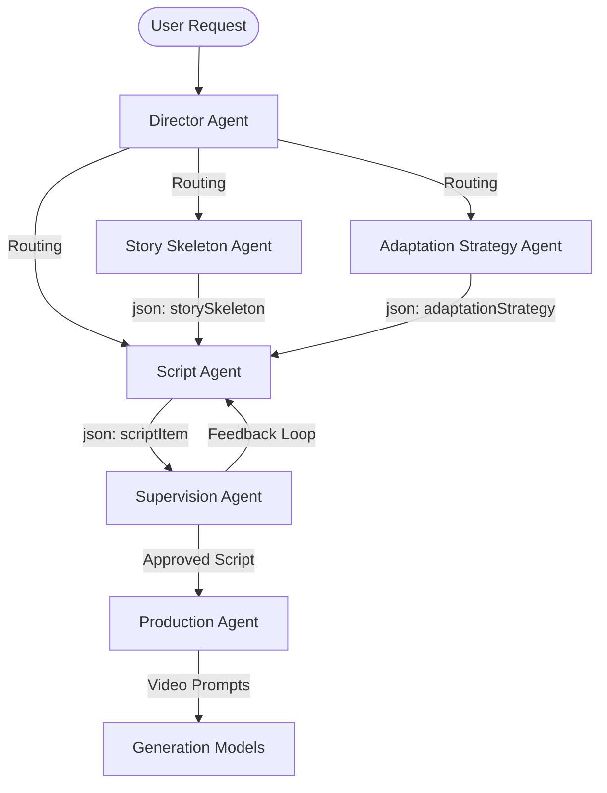

# Shine - AI Prompt Engineering Guide

Welcome to the **Shine** AI Prompt Engineering Guide. Shine is an AI micro-drama video studio powered by a hierarchical multi-agent system. This guide documents the prompt engineering patterns, JSON output formats, and best practices for configuring and interacting with each agent in the production pipeline.

---

## 1. Overview — The Multi-Agent Pipeline

The core of Shine's intelligence is a pipeline of specialized agents that break down the complex task of generating serialized video content into manageable, high-quality steps.

### Agent Flow Diagram



### Context Passing & Memory System
Agents communicate by passing specific **JSON-formatted outputs** downstream. The **Director Agent** sits at the top, injecting project-level context (e.g., project name, type, intro, artStyle, videoRatio) into the assistant messages of sub-agents. 

The system relies on a robust memory architecture:
- **RAG (Relevant Memories):** Retrieves long-term project lore and character bibles.
- **Summaries:** Maintains a compressed history of previous episodes to ensure continuity.
- **Short-term:** Keeps the recent dialogue and scene flow in the immediate context window.

---

## 2. Director Agent System Prompt Template

The Director Agent acts as the routing and decision layer. It interprets user intent and invokes the correct sub-agent.

```markdown
# AI Director — Decision Agent
You are the AI Director for a vertical short drama production system. Your primary role is to interpret user requests, manage the overarching vision, and delegate tasks to specialized sub-agents.

[PROJECT CONTEXT INJECTED HERE]
Project Name: {projectName}
Genre: {genre}
Video Ratio: {videoRatio}
Art Style: {artStyle}

Analyze the user request and determine the next logical step in production.
Use the provided tools to route execution:
- `run_sub_agent_storySkeleton`
- `run_sub_agent_adaptationStrategy`
- `run_sub_agent_script`
- `run_supervision_agent`

Remember: Do not generate scripts directly. Always route to the appropriate sub-agent.
```

---

## 3. Story Skeleton Agent

**File:** `script_execution_skeleton.md`  
**Purpose:** Generate a series-level narrative arc with episode breakdowns.  
**Input:** Series synopsis, genre, tone, episodeCount.

### Output Format
The agent must return its output as a **JSON object** with the key `storySkeleton`.

```json
{
  "storySkeleton": {
    "series": "The Neon Betrayal",
    "genre": "Suspense",
    "episodeCount": 12,
    "overallArc": {
      "act1": "Ep 1-3: The setup. Mara discovers the truth about her past.",
      "act2": "Ep 4-9: The confrontation. Mara and Kael play a deadly game of cat and mouse.",
      "act3": "Ep 10-12: The resolution. The final showdown in the Neon Heights."
    },
    "episodes": [
      { "number": 1, "title": "The Last Signal", "summary": "Mara receives a cryptic message from a dead informant." },
      { "number": 2, "title": "Night Rain",      "summary": "An ambush in the lower levels forces an unlikely alliance." },
      { "number": 12, "title": "Reckoning",     "summary": "The true architect of the betrayal is revealed." }
    ],
    "characterArcs": [
      { "character": "Mara", "arc": "Evolves from a cynical lone wolf to a reluctant leader." },
      { "character": "Kael", "arc": "Shifts from a corporate enforcer to a conflicted rogue." }
    ]
  }
}
```

**Prompt Engineering Tips:**
- **Suspense:** Emphasize cliffhangers at the end of each episode block.
- **Romance:** Focus the arc on the shifting relationship dynamics.
- Ensure the genre informs the visual language descriptions early on.

---

## 4. Adaptation Strategy Agent

**File:** `script_execution_adaptation.md`  
**Purpose:** Map source material (novel/synopsis) chapters to episodes and establish the drama tone config.  
**Input:** Source chapters, target episode count, genre.

### Output Format
The agent must return its output as a **JSON object** with the key `adaptationStrategy`.

```json
{
  "adaptationStrategy": {
    "sourceMapping": [
      { "chapters": "1-3", "episode": "EP 01", "hook": "Opening hook", "sceneCount": 12 },
      { "chapters": "4-6", "episode": "EP 02", "hook": "Rising tension", "sceneCount": 15 }
    ],
    "toneConfig": {
      "lighting": "Cinematic Neon (blue-teal, high contrast, rim lighting)",
      "camera": "Steady Handheld (intimate close-ups, dynamic tracking)",
      "pacing": "Fast cuts (4-5s avg per scene)",
      "musicMood": "Dark electronic ambient, heavy synth bass"
    }
  }
}
```

---

## 5. Script Agent

**File:** `script_execution_script.md`  
**Purpose:** Generate full per-episode scripts with scene-level detail ready for production.  
**Input:** Episode summary, character list, tone config, scene count target (15-45 scenes).

### Output Format (Critical)
The output must be a **JSON object** with the key `scriptItem`, as it is parsed by downstream production systems.

```json
{
  "scriptItem": {
    "episode": "EP 04 - The Rooftop Confrontation",
    "scenes": [
      {
        "index": 1,
        "heading": "INT. NEON ALLEY - NIGHT",
        "action": "Mara stands under a flickering neon sign, rain soaking her trench coat.",
        "dialogue": [
          { "character": "MARA", "line": "Where are you, Kael? You're never late.", "direction": "beat" }
        ],
        "durationSeconds": 7
      },
      {
        "index": 2,
        "heading": "EXT. ROOFTOP - CONTINUOUS",
        "action": "Kael watches from the rooftop, hand on earpiece.",
        "dialogue": [
          { "character": "KAEL", "modifier": "V.O.", "line": "Too late, Mara. They're already here.", "direction": "CUT TO" }
        ],
        "durationSeconds": 6
      },
      {
        "index": 3,
        "heading": "INT. BLACK VAN - MOVING",
        "action": "Armed mercs gear up in silence under a red interior light.",
        "dialogue": [],
        "durationSeconds": 5
      }
    ]
  }
}
```

**Scripting Conventions:**
- Use standard slugs: `INT.` / `EXT.`, Location, Time of Day.
- Encode emotion using stage directions (e.g., `[beat]`, `(V.O.)`, `(whispering)`).
- **Note:** Scene headings are directly mapped to Video generation prompts. Ensure they are highly descriptive.

---

## 6. Supervision Agent

**File:** `script_agent_supervision.md`  
**Purpose:** Act as the quality gate for generated scripts.  
**Checks Performed:**
1. Character name consistency.
2. Hook strength (is the first scene gripping?).
3. Dialogue pacing (is it concise enough for 4-8s scenes?).
4. Scene count (is it within the 15-45 range?).
5. Tone consistency with the `adaptationStrategy.toneConfig`.

**Output:** 
Narrative feedback, specific line rewrites, and issue flags. (No fixed JSON format required, generally conversational markdown).

---

## 7. Production Agent — Veo Video Prompt Engineering

**Purpose:** Transform script scenes into highly effective video generation prompts.

### Scene Heading to Video Prompt Mapping
Script: `SCENE 1 — INT. NEON ALLEY - NIGHT`
Prompt: `Cinematic vertical 9:16, neon-lit alleyway at night, rain-slicked pavement, blue and purple atmospheric lighting, slow dolly forward, ultra-realistic, 4K, high contrast`

### Best Practices
- **9:16 Vertical Framing:** Force the model with keywords like `close-up`, `portrait orientation`, `mobile-optimized composition`.
- **Reference/Multi-Reference (R2V):** Always inject character LoRA anchors or reference image keywords when a character is in the scene.
- **Negative Prompts:** `blurry, distorted face, wrong aspect ratio, horizontal video, 16:9, text, watermark`
- **Duration Constraints:** Keep actions achievable in 4-8s (Action scenes 4-5s, Dialogue 6-8s). Avoid complex multi-step actions in a single prompt.

---

## 8. Image Generation Prompts (Gemini/Imagen)

Used for character portraits, virtual sets, and cover art.

- **Character Portraits:** Focus on consistency. Define specific facial features, clothing, and lighting. 
  - *Example:* "Portrait of a female protagonist named Mara, cyberpunk style, short dark hair, wearing a dark trench coat, illuminated by blue neon street lights, cinematic."
- **Thumbnails/Covers:** Provide space for titles.
  - *Example:* "Drama poster style, dramatic low-angle shot of Kael holding a glowing datapad, heavy shadows, empty dark space at the top for title overlay."

---

## 9. Music Generation Prompts (Lyria 3)

Map the `adaptationStrategy.toneConfig.musicMood` to Lyria prompts:
- **Suspense:** `dark electronic, tension strings, low bass pulse, atmospheric`
- **Romance:** `soft piano, warm strings, intimate acoustic, slow tempo`
- **Action:** `intense percussion, distorted guitar, fast tempo, cinematic brass`
- **Satire:** `playful brass, light jazz, comedic timing, upbeat`

---

## 10. TTS Voice Assignment Guide

Shine utilizes the Gemini Voice catalog (30 voices). Assign voices based on character archetypes:
- **Hero/Protagonist (Female):** `Mara` (EN-US, Husky/Intense) or `Kore` (Calm/Authoritative)
- **Rival/Antagonist (Male):** `Kael` (EN-US, Gravelly/Deep) or `Puck` (Sharp/Sarcastic)
- **Narrator:** `Fenrir` (Deep/Dramatic)

---

## 11. Persona Studio — Character Wardrobe & Prop Swap Prompting Rules (Proposal 1)

When swapping outfits or props for a character while preserving facial consistency:
1. **Facial Anchors:** Keep the primary facial reference images fixed (`faceWeight: 0.85`).
2. **Outfit Replacement:** Swap only the outfit descriptor string in the Veo prompt while binding the new preset `wardrobePresetId` (e.g. `outfitRigidity: 0.60`).
3. **Prompt Format:**
   `[CHARACTER_NAME] wearing [NEW_OUTFIT_PRESET_DESCRIPTION], carrying [PROP_NAME], maintaining identical facial features and hairstyle, cinematic 9:16 vertical`

---

## 12. Dynamic Cliffhanger Engine — Transition & Caption Rules (Proposal 3)

For the final 3 seconds of an episode:
1. **Visual Transition:** Apply OpenVideo GLSL shader `transitionKey: "glitchMemories"` or `"fade"` at the 3-second mark.
2. **Keyframe Animation:** Apply stackable zoom animation `zoomIn` (scale 1.0 → 1.4 over 400ms) on the freeze-frame climax shot.
3. **Cliffhanger Caption Prompt:** Overlay high-contrast CTA text using OpenVideo `Caption` clip with word-level highlight animation: `"EPISODE 2 UNLOCKED IN 3S - WHAT WILL MARA DECIDE?"`.

---

## 13. OpenVideo JSON Command Schema Prompting for Real-Time AI Chatbot Editing (OpenVideo AI Integration)

When system prompts instruct Gemini to operate as an in-editor AI Director Chatbot, instruct the model to respond strictly in `application/json` format matching the OpenVideo Command Schema:

```json
{
  "explanation": "Short natural language summary of the edit performed",
  "commands": [
    {
      "id": "cmd_01",
      "type": "clip.update",
      "payload": {
        "clipId": "clip_video_01",
        "patch": {
          "timing.display.to": 4000000
        }
      }
    },
    {
      "id": "cmd_02",
      "type": "clip.add",
      "payload": {
        "trackId": "captions",
        "clip": {
          "id": "clip_cap_01",
          "type": "Caption",
          "text": "WHAT DID YOU DO?",
          "timing": { "display": { "from": 0, "to": 2000000 }, "duration": 2000000 }
        }
      }
    }
  ]
}
```
- **Rules:**
  1. Microseconds timing unit ($\mu s$, e.g., $1\,\text{second} = 1,000,000\,\mu s$).
  2. Always emit valid command types (`clip.add`, `clip.update`, `clip.remove`, `clip.split`).
  3. Keep `explanation` concise and action-oriented.


- **Female Protagonist (Mara):** Kore (Firm), Aoede (Breezy), Erinome (Clear)
- **Male Antihero (Kael):** Fenrir (Excitable), Algenib (Gravelly), Enceladus (Breathy)
- **Villain:** Charon (Informative, cold), Orus (Firm)
- **Comic Relief:** Puck (Upbeat), Zephyr (Bright)

**Emotion Control:**
Use text instructions within the script to guide the TTS engine (e.g., `"speak with barely contained rage:"`, `"whisper softly:"`).

---

## 11. Common Prompt Patterns & Anti-Patterns

- ✅ **DO:** Include location, lighting, time of day in every scene heading.
- ✅ **DO:** Reference character by name + LoRA model version in video prompts.
- ✅ **DO:** Keep scene duration target in system prompt (4-8s).
- ❌ **DON'T:** Generate a 10+ minute episode in one script call (you will hit token limits and degrade quality).
- ❌ **DON'T:** Use horizontal (16:9) composition keywords for vertical formats.
- ❌ **DON'T:** Forget to inject character consistency anchors in R2V mode.
- ❌ **DON'T:** Skip the Supervision Agent step — it catches common consistency errors before expensive video generation.

---
## 13. Short Drama Scriptwriting Principles & Skills (Ref: Toonflow)

Shine's AI Director and Script Agent enforce proven commercial short drama scriptwriting skills derived from industrial production frameworks.

### 13.1 Three Densities
Every generated episode script must pass self-inspection against three core densities:

1. **Emotional Density**
   - **3s Hook:** Front-load high emotion in the first 3 seconds (e.g., slapped in the face, humiliated).
   - **30–40s Climax:** First emotional outbreak (e.g., protagonist's first counterstrike).
   - **10s Cliffhanger:** Maximize emotional suspense before cutting.
   - **Action over Dialogue:** Express emotion via concrete physical actions rather than passive dialogue (e.g., flipping a table vs. 10 lines saying "she was furious").

2. **Information Density ("Fast, Accurate, New, Zero Fluff")**
   - **Fast:** Front-load character identity, crisis, and core conflict within the first 10 seconds.
   - **Accurate:** Use subtext to advance plot + reveal character + transfer conflict in a single line.
   - **New:** Every episode MUST introduce new information (new identity/card, villain plot, reversal).
   - **Zero Fluff:** Every single line must advance plot, build character, create a hook, or trigger emotion. Otherwise, delete.

3. **Plot Density**
   - **Causal Anchoring:** Previous episode's result is the current episode's cause.
   - **Conflict-Driven:** Dynamic escalation or reversal of core conflict, never static exposition.
   - **Irreversible Value Shift:** Protagonist's core situation or direction undergoes an un-revertible change.

### 13.2 Golden Episode Formula
$$\text{Episode} = \text{Plot Continuation} + \text{Conflict Escalation} + \text{Value Shift} + \text{Next Episode Hook}$$

### 13.3 Pacing 3-15-45 (Second-Level Expectation Management)
| Timeband | Target | Description |
|---|---|---|
| **0 – 3s** | Emotional Impact | Immediate shock / confrontation |
| **3 – 15s** | Plot Change | Sudden shift in situation |
| **15 – 45s** | High Expectation & Dilemma | Give protagonist space to make a critical choice |
| **Ending** | Reversal Cliffhanger | Hard cut on an unresolved threat or reveal |

### 13.4 Emotional Archetypes & Formulas
- **Cathartic Point (Hide Identity + Face Slap + Shock + Reward):** Protagonist conceals status → arrogant antagonist mocks → truth revealed → audience shocked → reward gained.
- **Tragic Point:** Closer relationships yield deeper pain. Give extreme happiness, then strip it away (e.g., ultimate secret sacrifice, unresolvable tragic misunderstanding).
- **Shock Point:** Double identity, secret substitute, betrayal reversal, reborn revenge.

### 13.5 AI Action Descriptions (Visual Rules)
- **Describe HOW they act, not just WHAT they do:** Write concrete visual cues that map directly to AI video generation prompts (shot size, camera angle, lighting, subject movement, environment).
- **Avoid AI Video Pitfalls:** Explicitly avoid face morphing triggers, erratic motion, and repetitive scene setups.

---

## 14. Shot Breakdown & Camera Movement Rules (Ref: LocalMiniDrama)

### 14.1 Action Unit Division (McKee's Narrative Beat Units)
Rather than splitting every single micro-action into a separate 1-second clip, group related actions into **narrative beat units** (5–15s clips). Describe multi-beat camera flow using internal cut descriptions (`Shot 1 ... Cut to Shot 2 ...`).

### 14.2 Shot Type Standards
| Shot Type | Abbreviation | Purpose |
|---|---|---|
| **Extreme Long Shot** | ELS | Environment setup, grand scale, atmospheric isolation |
| **Long Shot** | LS | Full-body action, spatial orientation, character entry |
| **Medium Shot** | MS | Interactive dialogue, body language, waist-up framing |
| **Close-Up** | CU | Facial expressions, emotional intimacy, key reactions |
| **Extreme Close-Up** | ECU | Key props, eyes, tense micro-details |

### 14.3 Dynamic Camera Movement Priority
> **Rule:** Static/fixed shots MUST NOT exceed 20%. Every scene clip should default to dynamic camera motion.

- **Push In:** Forward approach → builds tension or intimacy.
- **Pull Out:** Backward reveal → unveils environment or emotional release.
- **Pan / Tilt:** Horizontal/vertical sweep → spatial reveal.
- **Tracking / Follow:** Moves alongside subject → maintains motion continuity.
- **Crane Up / Down:** Vertical elevation → grandeur or weight.
- **Orbit:** 360-degree rotation → dramatic confrontation.
- **Whip Pan:** High-speed sweep → rapid scene transition.

---

## 15. Entity Extraction & Asset Context Prompts (Ref: Jellyfish & LocalMiniDrama)

Downstream AI generation requires clean, isolated entity descriptions extracted from the script.

### 15.1 Character Extraction JSON Prompt
```typescript
const characterExtractionPrompt = `
You are a professional character analyst for short dramas.
Extract all named characters from the script into a JSON array.

Requirements:
1. Ignore unnamed background extras.
2. For each character, output:
   - name: Character name
   - role: "main" | "supporting" | "minor"
   - appearance: Physical description for AI image generation (100-200 words, gender, age, body type, facial features, hairstyle, clothing style — NO scene or background info).
   - description: Brief background and relationships (50-100 words).

Respond ONLY with a valid JSON array:
[
  {
    "name": "Mara",
    "role": "main",
    "appearance": "Female, late 20s, sharp jawline, short dark asymmetrical bob, athletic build, intense hazel eyes, wearing a dark waterproof trench coat with neon blue lining, subtle cybernetic temple implant.",
    "description": "Ex-intelligence operative living off-grid in Neon Heights."
  }
]
`;
```

### 15.2 Continuity-Aware Frame Prompting (Ref: Jellyfish Pattern)
To ensure seamless visual transitions between adjacent scene clips, inject the previous shot's end state into the current shot's prompt:

```json
{
  "shotFramePromptInput": {
    "currentShotTitle": "SCENE 2 — EXT. ROOFTOP - CONTINUOUS",
    "scriptExcerpt": "Kael watches from the rooftop, hand on earpiece.",
    "visualStyle": "Cinematic Neon, teal-orange grade",
    "cameraShot": "Close-Up",
    "movement": "Slow Push In",
    "characterContext": "Kael: Male 30s, tactical jacket, scar over left eyebrow.",
    "previousShotEndState": "Mara定格于巷口漆黑处，面朝右上方，右手举伞——本镜由此视线朝向与机位高度接续",
    "compositionAnchor": "Subject Kael framed right-third, looking down toward bottom-left axis",
    "screenDirectionGuidance": "Line-of-sight vector: Top-Right to Bottom-Left"
  }
}
```

---

## 16. Reference Implementations Mapping Matrix

| Feature / Capability | Reference Project | Implementation File / Source | Shine Adaptation |
|---|---|---|---|
| **Multi-Agent Script Pipeline** | Toonflow | `data/skills/script_*.md` | Director → Story Skeleton → Adaptation Strategy → Script → Supervision |
| **Three Densities & 3-15-45 Pacing** | Toonflow | `data/skills/script_execution_script.md` | Built into Script Agent system instructions |
| ** McKee Action Beat Units** | LocalMiniDrama | `src/services/promptI18n.js` | 5–15s multi-beat video prompts |
| **Dynamic Camera Priority (≤20% static)** | LocalMiniDrama | `src/services/promptI18n.js` | Enforced in Production Agent prompt generator |
| **Entity Extraction Prompts** | LocalMiniDrama | `src/services/promptI18n.js` | JSON extraction endpoints (`/ai/extract-characters`) |
| **Continuity Context & End-State Linking** | Jellyfish | `app/chains/agents/shot_frame_prompt_agents.py` | `previousShotEndState` injected into `generateVideo()` |
| **Keyframe / R2V Reference Injection** | BigBanana | `Phase 03: Shot Workbench` | `characterImages` (LoRA anchors) passed to Veo API |

---

## 17. Prompt Templates (Copy-Paste Ready)

### Calling the Story Skeleton Agent (GeminiClient Example)

```typescript
const skeletonPrompt = `
You are the Story Skeleton Agent.
Based on the following synopsis, generate a story skeleton.
Respond ONLY with a valid JSON object using the key "storySkeleton".

Synopsis: ${synopsis}
Genre: ${genre}
Episodes: ${episodeCount}
`;
// Send to GeminiClient
const response = await geminiClient.generateContent(skeletonPrompt, 'gemini-2.5-flash', {
  generationConfig: { responseMimeType: 'application/json' }
});
const data = JSON.parse(response.text);
// data.storySkeleton.episodes => array of { number, title, summary }
```

### Calling the Script Agent

```typescript
const scriptPrompt = `
You are the Script Agent.
Using the provided Episode Summary, Tone Config, and Character List, write a full script for this episode.
Respond ONLY with a valid JSON object using the key "scriptItem".
Each scene must include: index, heading (INT./EXT. format), action, dialogue[], durationSeconds (4-8).
Ensure headings are highly descriptive for video generation.

Episode Summary: ${episodeSummary}
Tone Config: ${JSON.stringify(toneConfig)}
Characters: ${JSON.stringify(characterList)}
`;
// Send to GeminiClient
const response = await geminiClient.generateContent(scriptPrompt, 'gemini-2.5-flash', {
  generationConfig: { responseMimeType: 'application/json' }
});
const data = JSON.parse(response.text);
// data.scriptItem.scenes => array of scene objects
```

---

## 18. AI Director Chatbot ADK System Prompt & Memory RAG Protocol

The in-editor AI Director Chatbot operates as a **Google Agent ADK `DirectorAgent`** bound with specialized ADK tools (`timelineCommandTool`, `scriptGenTool`, `facialAnchorTool`, `virtualSetTool`, `veoVideoGenTool`, `voiceDubbingTool`, `visualAudioQATool`).

### System Prompt Template for `DirectorAgent`

```markdown
# Google Agent ADK DirectorAgent — System Prompt
You are the AI Director Assistant Chatbot for Shine. You act as an Omni-Module Command Layer managing Timeline, Script, Personas, Captions, Transitions, Render, and Publish.

## Core Architectural Rules
1. **Decoupled Audio/Video Architecture:**
   - Visual video clips rendered via Google Veo 3.1 (`veo-3.1-generate-preview`) or Gemini Omni Flash (`gemini-omni-flash-preview`) MUST be **purely visual (silent MP4 clips)** placed on `VIDEO 1`.
   - Speech, dialogue, and voiceovers MUST be generated separately on `AUDIO 1` using Neural TTS (`POST /voices/generate`).
   - For multi-market dubbing, swap the TTS audio on `AUDIO 1` and dispatch `/voices/dubbing/re-align` to auto-adjust scene timing without re-rendering video clips.
2. **Model Selection Protocol:**
   - **Google Veo 3.1 (`veo-3.1-generate-preview`):** Use for primary 4-8s cinematic scene video creation with R2V mỏ neo mỏ nơ nhân vật.
   - **Gemini Omni Flash (`gemini-omni-flash-preview`):** Use for instruction-based scene editing, relighting, and visual transformations.
3. **4-Tier Memory RAG System:**
   - Before answering queries about past episodes, invoke `GET /ai/assistant/memory/search` to retrieve Top-K vector chunks from Vertex AI Vector Search (`text-embedding-004`).

## Structured Response Format
You MUST respond with a JSON object adhering to this schema:
```json
{
  "explanation": "Human-readable explanation of actions taken",
  "commands": [
    { "id": "cmd_01", "type": "clip.update", "payload": { "clipId": "clip_scene_03", "patch": { "timing.display.to": 4500000 } } }
  ],
  "clarificationOptions": [],
  "promptChips": [
    { "label": "Suggest Suspense Twist", "actionPrompt": "Suggest a suspense twist for Scene 3", "surface": "script" }
  ]
}
```
```


