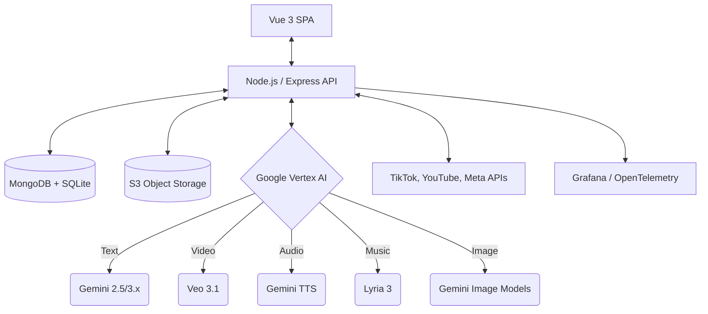
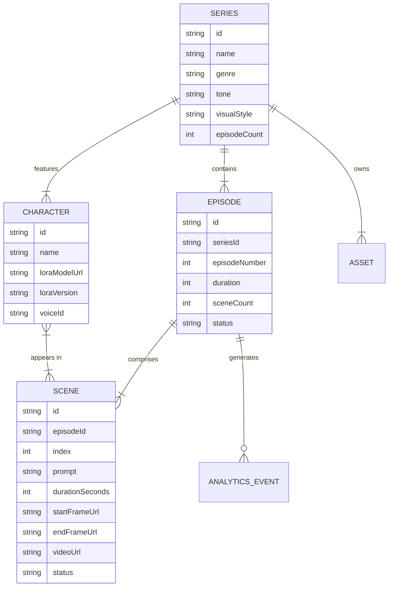
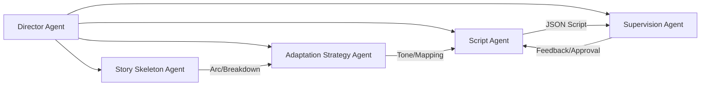
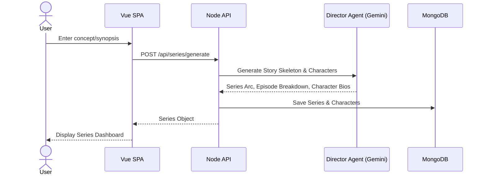
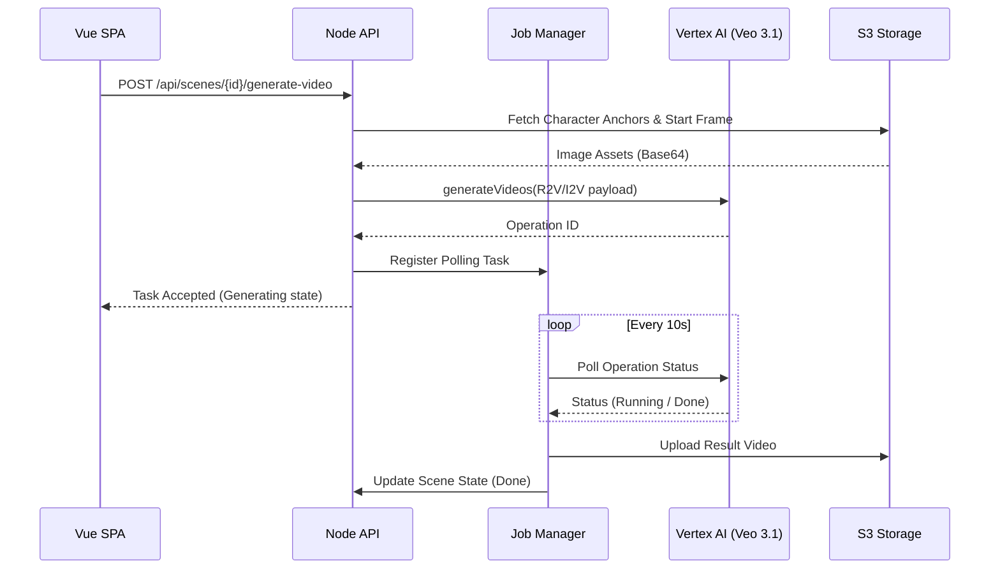
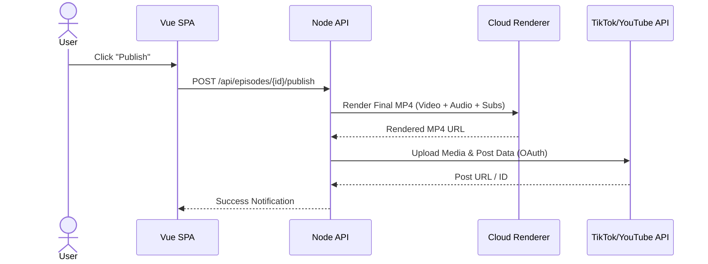

# Architecture Document: Shine (DramaFlowAI) - AI Micro-Drama Video Studio

## 1. System Overview

Shine (DramaFlowAI) is an enterprise-grade AI-powered platform tailored for creating serialized vertical short dramas (9:16 aspect ratio, typically 20-50 episodes of 1-3 minutes each). The platform integrates a Vue 3 frontend, a Node.js (Express) backend, and heavily utilizes Google Vertex AI for all generative tasks via the official `@google/genai` SDK. By orchestrating a multi-agent AI pipeline and a specialized multi-modal generation pipeline (Video, Audio, Image, Text), Shine enables end-to-end creation, character consistency management, episode editing, and social platform distribution.



## 2. Content Model

The core hierarchy of DramaFlowAI maps directly to the serialized short drama format.



## 3. Frontend Architecture

The frontend is a Vue 3 Single Page Application (SPA) built with Vite and TypeScript, providing a rich, interactive canvas and timeline for episode editing.

- **Framework**: Vue 3 (Composition API, `<script setup>`)
- **Build Tool**: Vite
- **State Management**: Pinia (stores for Series, Episode, Editor Timeline, Character Library, and Job Queue)
- **Routing**: Vue Router
- **Key Modules**:
  - `ScriptWorkspace`: AI Director interaction, script breakdown.
  - `StoryBoard`: Shot preparation, character assignment, start/end frame generation.
  - `TimelineEditor`: Video/Audio/Subs multi-track sequence editor.
  - `TaskCenter`: Unified interface for tracking async Veo/Lyria generation jobs.

## 4. Backend Architecture

The backend is an Express-based Node.js service designed to act as a robust orchestrator for AI tasks and data persistence.

- **Core Framework**: Node.js + Express
- **Language**: TypeScript
- **State Machine**: Orchestrates the shot readiness lifecycle (Pending → Prepared → Generating → Done) for async generation jobs.
- **Key Services**:
  - `AIService`: Wraps the GeminiClient to interface with Google Vertex AI.
  - `JobManager`: Manages async long-polling jobs (like Veo video generation up to 10 minutes).
  - `AssetManager`: Handles S3 object uploads/downloads and pre-signing.
  - `SocialPublisher`: Handles OAuth and publishing to TikTok/YouTube/Instagram.

## 5. AI Pipeline Architecture

Shine employs a multi-agent "Director" pipeline and a multi-modal generation interface via `@google/genai`.

### Multi-Agent Pipeline (Decision Layer)


### Vertex AI Modality Mapping & Routing
| Capability | Model | Method | Location |
| :--- | :--- | :--- | :--- |
| Text / Reasoning | gemini-2.5-flash / gemini-3.x | `generateContent()` | `us-central1` (2.5) / `global` (3.x) |
| Image Generation | Imagen / Gemini Native | `generateImage()` | `global` |
| Video Generation | veo-3.1-* | `generateVideo()` | `global` |
| TTS / Dialogue | Gemini TTS | `generateAudio()` | `global` |
| Music | Lyria 3 | `generateMusic()` | `global` |
| Real-time Interactivity| Gemini Live | `connectLive()` | `global` |

## 6. Video Generation Pipeline (Veo 3.1) & Decoupled Audio Architecture

The backend handles the async nature of Veo video generation through a distinct pipeline wrapped in `GeminiClient.ts`.

> [!IMPORTANT]
> **Decoupled Audio/Video Architecture for Multi-Market Dubbing:**
> Video clips generated by Google Veo (`veo-3.1-generate-preview`) are **purely visual (silent MP4 clips)** placed on the `VIDEO 1` track. Speech, dialogue, and voiceovers are generated **completely separately on dedicated audio tracks (`AUDIO 1`) using Neural TTS (`POST /voices/generate`)**. This decoupling allows creators to instantly switch languages for multi-market dubbing (English, Spanish LatAm, Vietnamese, Chinese, French) by swapping the TTS audio file on `AUDIO 1` and auto-realigning scene timing ($\Delta t_{\mu s}$) without re-rendering expensive video clips!

1. **Resolution**: Download/resolve reference images (HTTP URL / S3 key) and convert to base64.
2. **Payload Construction**: Build the request payload specifying `model=veo-3.1-generate-preview` and `location=global`.
   - **I2V (Image-to-Video)**: Uses a single `image` (start frame).
   - **Interpolation**: Uses `image` (start frame) and `lastFrame` (end frame).
   - **R2V (Reference-to-Video)**: Incorporates `referenceImages[]` containing LoRA anchors for character consistency.
3. **Execution**: Invoke `generateVideos()` to start the async operation.
4. **Polling**: Poll the operation ID (maximum 60 attempts × 10s interval = 10-minute timeout).
5. **Storage**: Receive `videoBytes` (inline) or `gcsUri`, and persist the final MP4 to S3-compatible storage.


## 7. Character Consistency System

Maintaining visual continuity across a series is critical.

- **LoRA Models**: Each primary character has a dedicated high-res LoRA model (e.g., 1.4GB) stored in S3.
- **Facial Consistency Anchors**: Up to 8 reference anchor images per character. These are injected into the `referenceImages` array in Veo API calls to ensure facial mesh matching (targeting 98.4% consistency).
- **Outfit Locks**: Texture and silhouette metadata are locked per episode to prevent hallucinated wardrobe changes.
- **Voice Profiles**: Stable Gemini TTS voice profiles (`voiceId`) are persisted per character.

## 8. Episode Editor Architecture

The editor uses a standard Non-Linear Editor (NLE) timeline model adapted for AI generation.

- **Canvas Workflow**: A scene transitions through states: Text Prompt → Start Frame → End Frame → Video Clip.
- **Track Structure**:
  - `VIDEO 1`: The primary visual sequence consisting of 15-45 scenes (4-8s each).
  - `AUDIO 1`: Composite track containing generated TTS dialogue (WAV) and background music (Lyria 3).
  - `SUBS 1`: Subtitle track driven by auto-generated timestamps from the script.
- **OpenVideo Command-Driven Architecture & Patch Sync**:
  - **Command Dispatch**: Every timeline modification is triggered by dispatching a structured JSON command: `interface Command { id: string; type: string; payload: T; meta?: { source: "user" | "agent" | "system"; timestamp: number } }`.
  - **Atomic Patch Generation**: Command execution produces an array of atomic JSON patches: `interface Patch { op: "add" | "update" | "remove"; path: string; value?: any; oldValue?: any }` targeted at JSON Pointer paths (e.g. `/clips/clip_04/timing/display/to`).
  - **Real-Time Collaboration Sync**: When multiple editors work on the same episode, the Express/WebSocket server broadcasts lightweight `Patch[]` payloads instead of full state objects. Receivers apply patches via `core.applyPatches(patches)` for real-time visual feedback.
  - **Deterministic Undo/Redo**: History manager maintains a stack of inverse patches (`oldValue` ↔ `value`), enabling instant time-travel without server round-trips.
- **Real-Time AI Director Assistant Chatbot Integration (Google Agent ADK Architecture)**:
  - Powered by **Google Agent ADK (Agent Development Kit)** and Google GenAI SDK (`@google/genai`), implementing a modular `DirectorAgent` bound with a Tool Calling Registry:
    - `timelineCommandTool`: Translates prompts into structured OpenVideo `Command[]` arrays executed via `core.executeMany(commands)`.
    - `scriptGenTool`: Executes multi-agent script pipeline (`POST /ai/generate-script`).
    - `facialAnchorTool`: Extracts 8 facial anchors from uploaded actor images (`POST /characters/:id/facial-anchors`).
    - `virtualSetTool`: Generates 3D scene backgrounds (`POST /environments/generate`).
    - `veoVideoGenTool`: Synthesizes video clips with Veo 3.1 reference anchors (`POST /ai/video-gen`).
    - `voiceDubbingTool`: Synthesizes TTS audio and auto-realigns timeline clip bounds ($\Delta t_{\mu s}$).
    - `visualAudioQATool`: Executes Gemini Vision frame inspection and parametric EQ volume ducking.
  - User prompts (e.g. *"Shorten Scene 3 by 500ms and add a cinematic fade transition"*) are sent to `POST /ai/assistant/command-edit`.
  - Vertex AI LLM evaluates normalized workspace state (`exportToJSON()`), executes registered ADK tools, and returns structured commands & explanations to the client.
  - Executes 6 Advanced Intelligence Capabilities: Visual/Audio QA (Gemini Vision + EQ inspection), Beat-Synced Smart Captions, Retention Diagnostic & Script Doctoring, Real-Time Voice Acting Coaching, Cost Budget Optimization Advisor, and Interactive AntV G6 Story Tree Generation.
  - **Multimodal & Context-Aware Engine:** Ingests Images, Videos, PDF/DOCX Documents, and Real-Time Voice streams (`connectLive()`); dynamically dispatches surface-aware quick-action prompt chips matching current editor context.


- **Timeline Revision History & Zero-Render Preview Architecture**:
  - **Audit Log**: Every timeline save (`PUT /episodes/:id/timeline`) writes a version snapshot (`versionId`, `author`, `timestamp`, `changeSummary`, `timelineData`).
  - **Zero-Render Preview**: Clicking 'Preview' on any historical version loads the timeline JSON snapshot (`settings`, `tracks`, `clips`) directly into the browser's Vue 3 editor state. The HTML5 Canvas/WebGL & Web Audio engine plays the version in real time without triggering cloud video rendering.
  - **Version Restore**: Reverting to a version updates the active timeline pointer to that snapshot's data and appends a new audit record (`v1.4 - Restored to v1.1`).


## 9. Data Storage Architecture

- **MongoDB (Global / Cloud)**: Stores Series metadata, User configurations, and Analytics/Reporting data.
- **SQLite (Local / Project)**: Stores highly granular Episode, Scene, and Timeline state. This allows fast, offline-capable local editing before cloud synchronization.
- **S3 Object Storage**: Hosts all heavy media assets: video clips, generated WAV audio, LoRA weights, and reference images.

### 9.1 Hierarchical Vector Memory Bank & Series Knowledge Graph Architecture
- **Tier 1 (Sliding Window Session Memory):** Pinia & Redis session cache holding active timeline JSON (`studio.exportToJSON()`) and last 10 chat messages.
- **Tier 2 (Vertex AI Vector Search RAG):** Vectorizes per-scene scripts (`script_vector_idx`), character bibles (`persona_vector_idx`), timestamped comments (`comment_vector_idx`), and drop-off analytics (`analytics_vector_idx`) via `text-embedding-004` for <50ms similarity search.
- **Tier 3 (Series Knowledge Graph):** Directed Knowledge Graph linking `Series` ➔ `Episode` ➔ `Scene` ➔ `Character` ➔ `Asset`, maintaining character continuity across 50 episodes.
- **Tier 4 (Context Token Compressor):** Query rewriter expands entity IDs and token compressor strips structural JSON into a dense ~4KB Markdown summary payload.


## 10. External Integrations & Google Cloud Infrastructure

- **Google Vertex AI / Gemini API**: Core intelligence, multi-agent script orchestration, and generation engine. Uses **Gemini 3.5 Flash** (`gemini-3.5-flash`) for LLM/scripting, **Google Veo 3.1** (`veo-3.1-generate-preview`) for primary 4–8s cinematic scene video rendering with R2V character reference anchors, and **Gemini Omni Flash** (`gemini-omni-flash-preview`) for instruction-based multimodal scene video editing, relighting, and visual modification via **Google GenAI SDK (`@google/genai` v2.16.0)**.
- **GCP Infrastructure Services**: Headless Node.js `@openvideo/core` Compositor batch render workers deployed on **GCP Cloud Run**, media assets hosted on **Google Cloud Storage (GCS)**, and async render jobs queued via **Cloud Pub/Sub**.


- **Parallel MCP Services (Model Context Protocol)**:

  - **Real-Time Viral Trend & Competitor Script Engine**: Parallel MCP service that continuously crawls TikTok, Douyin, X, and App Store top charts for trending drama topics, high-retention tropes, and competitor script formulas.
  - **Cultural Compliance & Copyright Safety Engine**: Parallel MCP / Gemini Guardrails engine that audits script text, audio WAVs, and visual assets against multi-region content safety rules, age rating policies, and copyright/IP infringement databases prior to publishing.
- **Social Platform APIs**:
  - **TikTok Open API**: Direct video publishing, metadata sync, and comment stream aggregation.
  - **YouTube Data API v3**: YouTube Shorts publishing and comment moderation API.
  - **Meta Graph API**: Instagram Reels publishing and engagement comment API.
- **AI Audience Engagement & Comment Moderation Subsystem**:
  - **Auto-Reply Agent**: Generates context-aware, engagement-boosting replies to viewer comments.
  - **Auto-Moderation Agent**: Evaluates comments against community guidelines; flags or deletes toxic/spam comments via social platform APIs.
  - **Viewer Feedback Script Adaptation Loop**: Performs sentiment clustering on comment streams and feeds audience preference signals back to the AI Director Agent to dynamically adjust script arcs for unreleased future episodes.
- **Observability**: Metrics and traces exported via OpenTelemetry to Grafana.


## 11. Authentication & Security

- **Vertex AI Auth**: 
  - Backend uses Service Account JSON (`GOOGLE_APPLICATION_CREDENTIALS`) or Application Default Credentials (ADC).
- **Client Auth**: JWT-based authentication for the Vue 3 frontend communicating with the Express backend.
- **RBAC**: Role-based access control to delineate between Creators, Editors, and Admins.

## 12. Deployment Architecture

Deployments are containerized and optimized for Google Cloud.

- **Development**: Managed via Docker Compose (spins up Node.js API, MongoDB, MinIO for S3 emulation).
- **Production**: 
  - Frontend: Served via CDN / Cloud Storage.
  - Backend: GCP Cloud Run (stateless, autoscaling containers).
  - Database: MongoDB Atlas.

### 12.1 OpenVideo Headless Cloud Rendering Pipeline (Server-Side Batch Workers)
For multi-episode series batch rendering (20–50 episodes produced simultaneously), Shine offloads rendering from the client browser to headless Node.js cloud workers:

```
[Browser Vue SPA] 
  └── studio.exportToJSON()  ➔ Serialized Timeline JSON
                                  │
                                  ▼
[API Server (Express / Cloud Run)] ➔ Dispatch to Batch Worker Pool
                                  │
                                  ▼
[Headless Node.js Worker (@openvideo/core)]
  ├── Node Polyfills: crypto (@peculiar/webcrypto), WebSocket (ws)
  ├── const compositor = new Compositor(settings)
  ├── await compositor.loadFromJSON(projectData)
  └── const stream = await compositor.output() ➔ Rendered MP4 Video ➔ Upload to S3
```

- **Client-Side Mode (Browser):** Real-time interactive NLE editing, zero-render instant version previews (`studio.loadFromJSON()`), and fast single-episode local exports via OpenVideo Pixi.js / WebGL engine.
- **Server-Side Mode (Cloud Headless Workers):** High-throughput, headless `@openvideo/core` `Compositor` instances in Docker / Cloud Run containers executing batch multi-episode rendering directly from serialized timeline JSON payloads without requiring a browser display context.


## 13. Data Flow Diagrams

### A. Series Creation Flow


### B. Episode Generation Flow


### C. Export & Publish Flow


---

## 13. Infrastructure, Parity & Virality Architecture

### 13.1 OpenVideo Dual-Rendering Parity Audit Pipeline
- **Automated Parity Checker**: Node.js worker dispatches identical timeline JSON payload (`studio.exportToJSON()`) to both a headless Puppeteer/WebGL instance and a Headless `@openvideo/core` `Compositor`.
- **Pixel-Diff & Audio Waveform Alignment**: Performs pixel-by-pixel SSIM diff and audio sample cross-correlation. Any drift > 0.05% alerts the deployment pipeline prior to batch rendering.

### 13.2 Vertex AI Resource & Cost Guardrail Controller
- **Rate & Token Limiter Middleware**: Sits between Node.js API and Vertex AI SDK (`GeminiClient.ts`).
- **Budget Tracking Engine**: Tracks real-time token spend per project in Redis. If cost approaches project ceiling (e.g. $3.50 USD), requests switch to proxy models (`gemini-2.5-flash` instead of `gemini-3.x` or low-res video previews).

### 13.3 Viral A/B Analytics & Narrative Adaptation Loop
- **Multi-Variant Pipeline**: AI Script Director produces 3 episode ending payloads (`Variant_A_Mystery`, `Variant_B_Action`, `Variant_C_Romance`).
- **Social Performance Ingestion Worker**: Cron task queries TikTok Analytics API and YouTube Data API every 6 hours for retention at $t=3\text{s}$ and $t=\text{end}$.
- **Narrative Arc Selector**: Automatically updates the `Series.adaptationStrategy` state with the winning variant's emotional tags for remaining episodes.

### 13.4 Subscription Tier Feature Gating & Metering Middleware
- **Feature Entitlement Middleware (`server/middleware/checkTierLimit.ts`)**: Validates active JWT user subscription tier (Free $0, Creator Pro $29, Studio Team $149, Enterprise $499+) before dispatching heavy AI operations (4K rendering, AntV G6 story trees, 3D product placement, multi-editor WebSocket co-editing).
- **AI Credit Metering Engine**: Tracks monthly credit consumption in Redis and deducts credits per operation (e.g., Veo video generation = 25 credits/scene).


---

## 14. Interactive Branching, Sponsored Compositing & Offline Hybrid Architecture

### 14.1 AntV G6 Multi-Module Graph Suite (`@antv/g6`)
The platform leverages `@antv/g6` graph engine across 5 core workspace modules:
1. **Interactive Branching Narrative DAG Tree (`workspace-branching-tree`)**: Renders episode choice decisions using `dagre` node layouts with live audience choice percentages (`72% Choice A`).
2. **Character Relationship & Social Lineage Graph (`workspace-persona-studio`)**: Uses `force-directed` layout to map inter-character dynamics (Love, Betrayal, Alliance) across 50 episodes.
3. **Multi-Agent Workflow Execution Monitor (`workspace-ai-director`)**: Renders live glowing node graph tracking data flow between agents (Director ➔ Script ➔ Veo ➔ TTS).
4. **Spatial Audio 3D Soundstage Matrix (`workspace-audio-mixer`)**: Renders listener and sound source nodes on a 2D/3D plane for interactive spatial panning dragging.
5. **Asset Dependency Lineage Graph (`workspace-asset-library`)**: Displays dependency trees mapping LoRAs, Persona Avatars, and Virtual Sets to specific episode clips.


### 14.2 OpenVideo Sponsored Object Layer Compositing Pipeline
- **Surface Detector**: Gemini Vision detects 3D spatial bounding boxes for background surfaces (e.g. coffee table $[x_1, y_1, x_2, y_2]$).
- **Layer Compositor**: Injects sponsored product asset as a discrete OpenVideo visual clip layer with transform keyframes, perspective skew, and optional Chroma Key transparency.

---

## 15. Advanced Polish & Real-Time Co-Pilot Architecture (Proposals 13–16)

### 15.1 Kinetic Subtitle & Bass-Synced Highlight Engine (Proposal 13)
- **Word-Level Timing Alignment**: Parses word-level timestamps from Neural TTS output and generates SVG/Canvas word-highlight keyframe tracks on `SUBS 1`.
- **Bass-Synced Font Dynamics**: Listens to low-frequency audio energy ($20-120\text{Hz}$) on `AUDIO 2` (Music) and applies real-time font scale transforms ($1.0x \rightarrow 1.15x$) and auto-detected sentiment emojis (`🔥`, `😱`, `💔`).

### 15.2 3D Spatial Audio Soundstage & Emotion-Tuned TTS (Proposal 14)
- **Spatial Audio Panning**: Calculates 3D audio listener position from video camera motion metadata, panning SFX/ambience across $L/R$ audio channels.
- **Emotion Curve Auto-Tuning**: Evaluates script sentiment curves and applies parametric EQ, pitch-shifting, and room reverb filters to dialogue tracks (`AUDIO 1`).

### 15.3 AI Viral Cover Aesthetic Scanner & Social A/B Publisher (Proposal 15)
- **Face Aesthetic Scoring**: Scans episode video frames using Gemini Vision aesthetic evaluation, selecting optimal keyframes with highest face mesh quality scores.
- **Title Overlay Compositor**: Composites viral hook typography over keyframes and outputs 3 cover image variants for TikTok/Shorts A/B API publishing.

### 15.4 Real-Time Video Canvas Copilot Overlay Runtime (Proposal 16)
- **Playback Analyzer Worker**: Evaluates playback state against pacing heuristics, audio loudness meters, and shot continuity models in real time.
- **Canvas Feedback Bubbles**: Renders floating non-blocking UI alert bubbles on the WebGL preview canvas pointing out pacing delays, volume spikes, or visual anomalies.


### 14.3 Offline IndexedDB Command Queue & Reconnection Sync Pipeline
- **IndexedDB Storage Adapter**: Vue 3 editor intercepts OpenVideo commands and writes serialized `Command` and `Patch[]` objects to LocalStorage / IndexedDB when offline.
- **Delta Reconnection Sync**: Upon `window.ononline` event, client dispatches bulk offline patch queue (`POST /collaboration/sync-offline-patches`) to server for reconciliation.

---

## 16. Admin Back-Office & Operations Architecture (`/admin`)

### 16.1 Role-Based Access Control (RBAC) & Impersonation Engine
- **RBAC Middleware (`server/middleware/rbac.ts`)**: Enforces access tokens with role scopes (`SystemAdmin`, `FinOpsManager`, `Supporter`, `User`).
- **User Impersonation Engine (`POST /admin/impersonate`)**: Issues temporary scoped JWT tokens allowing Supporters to view user workspace states in read-only or consent-based edit mode.

### 16.2 FinOps Compute Cluster Control & Token Metering
- **GCP Cloud Run Queue Gauge**: Monitors active rendering containers via Cloud Run Admin API and Pub/Sub queue depth gauges.
- **Vertex AI Token Rate Limiter**: Integrates Redis token buckets to enforce strict per-series cost caps ($3.50/ep).

### 16.3 Observability & Telemetry Pipeline
- **OpenTelemetry Collector**: Instruments Node.js API server and `@openvideo/core` rendering workers, exporting subagent execution traces to Grafana dashboards.

---

## 17. Public Routes, Authentication Router & Static Docs Architecture

### 17.1 Vue Router Navigation Guard (`src/router/index.ts`)
- **Public Route Whitelist (`/`, `/auth/*`, `/terms`, `/privacy`, `/contact`, `/manual`)**: Accessible without authentication; unauthenticated users accessing workspace routes (`/workspace/*`, `/admin/*`) automatically redirect to `/auth/login`.

### 17.2 Passport & JWT Authentication Middleware (`server/middleware/auth.ts`)
- **OAuth 2.0 Strategy**: Passport Google & GitHub OAuth 2.0 strategies with automatic user profile creation and JWT cookie setting (`access_token` and `refresh_token`).

### 17.3 SSG/Markdown Manual Engine (`/manual`)
- **VitePress / Content Pipeline**: User manual renders static markdown guides, interactive prompt copy buttons, and embedded YouTube video walkthroughs with client-side instant search.

---

## 18. Multi-Language System UI Localization Architecture (`vue-i18n`)

### 18.1 Client-Side `vue-i18n` Bundle Manager (`src/locales/`)
- **Locale Dictionaries (`en.json`, `vi.json`, `zh.json`, `jp.json`, `es.json`, `fr.json`)**: Dynamic JSON translation bundles loaded lazily via Vite dynamic imports (`import(./locales/${locale}.json)`).
- **Pinia Locale Store (`src/stores/localeStore.ts`)**: Manages active UI locale, persists selection to `localStorage.setItem('user_locale', locale)`, and updates HTTP `Accept-Language` headers.

### 18.2 AI Chatbot Multilingual Prompt Detection & Output Localizer
- **Language Detection Pipeline**: Gemini 3.5 Flash automatically detects prompt language and responds in the same language while maintaining valid structural OpenVideo JSON `Command[]` payloads.


