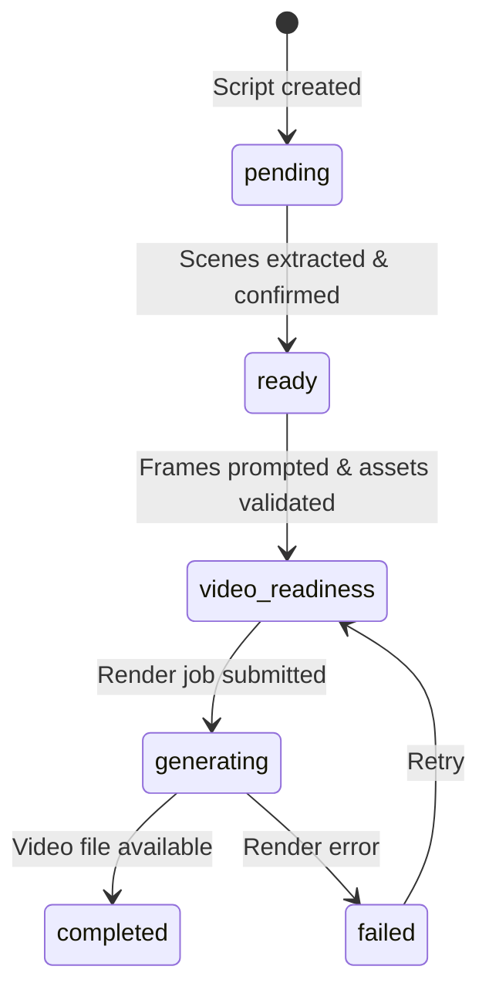

# Implementation Plan: Sprint 7 — OpenVideo Engine Integration, Real AI Services & Interactive E2E Testing

## Goal Description

Sprint 7 transitions **Shine AI Studio** from a static UI mockup into a **100% production-ready enterprise software**. Every user action must trigger real backend logic, real AI model calls, and real database state changes.

Sprint 7 is structured as **5 sequential Micro-Sprints**, each with a mandatory Gate checkpoint that must pass before proceeding to the next. This prevents the "ghost work" pattern where agents report completion without actual implementation.

> [!CAUTION]
> **Before writing any code**, agents must read and extract patterns from the reference projects in `apps/shine/tmp/`. A `scratch/research-notes.md` file must be submitted before Task 2 begins.

---

## Process Improvements (Applied from Sprint 7 Onwards)

| Improvement | Implementation |
|---|---|
| **Pre-Read Gate** | Agent reads reference projects first, submits `scratch/research-notes.md` |
| **Checkpoint Gates** | Each micro-sprint has a Gate — all rows in tracker must be ✅ before proceeding |
| **Mock Data Linter** | `pnpm run check-quality` auto-detects hardcoded arrays in Vue components |
| **API Contract First** | `server/openapi.yaml` updated before implementing any new route |
| **DB Schema First** | Migration SQL file created before writing any service code |
| **Skills Library** | All AI prompts live as versioned `.md` files in `server/src/skills/` |
| **Progress Streaming** | Socket.io event stream for all long-running AI operations |
| **Honest Tracker** | `docs/sprint-7-tracker.md` updated with ✅ / ⚠️ / ❌ real status + evidence |

---

## 1. Reference Architecture & Core Source Repositories

Before any implementation begins, read and extract patterns from:

### 1.1 Reference Projects in `apps/shine/tmp/`

- **[`Toonflow-app-master`](../tmp/Toonflow-app-master)**:
  - 3-layer AI agent pipeline (`Decision → Supervision → Execution`)
  - Skill `.md` prompt files in `data/skills/` (port into `server/src/skills/`)
  - WebSocket real-time streaming architecture

- **[`LocalMiniDrama-main`](../tmp/LocalMiniDrama-main)**:
  - Multi-provider AI client (`aiClient.js`) — Gemini, OpenAI, DeepSeek routing
  - Full storyboard pipeline (`episodeStoryboardService.js` — 72KB production-grade)
  - Character LoRA anchor management (`characterLibraryService.js` — 49KB)
  - TTS voice synthesis service (`ttsService.js`)
  - Multi-language prompt i18n (`promptI18n.js` — 135KB)

- **[`Jellyfish-main`](../tmp/Jellyfish-main)**:
  - Episode state machine (`pending → ready → video-readiness → generating → completed`)
  - Background async task execution engine (`app/tasks/execute_task.py`)
  - Multi-agent script processing chain (`app/chains/agents/`)
  - OpenAPI contract-first development discipline (`AGENTS.md`)

- **[`BigBanana-AI-Director-main`](../tmp/BigBanana-AI-Director-main)**:
  - AI Director multi-stage prompt chain design
  - Series skeleton → Episode scripts → Scene shots → Frame prompts pipeline

### 1.2 OpenVideo Official Docs

- `https://docs.openvideo.dev/core/00-getting-started`
- `https://docs.openvideo.dev/core/01-concepts`
- `https://docs.openvideo.dev/core/02-guides`
- `https://docs.openvideo.dev/core/03-creative`
- `https://docs.openvideo.dev/core/04-advanced`
- `https://docs.openvideo.dev/core/05-reference`

### 1.3 vue-editor Reference Implementation

- Core setup: [`apps/vue-editor/src/lib/project.ts`](../../../apps/vue-editor/src/lib/project.ts)
- Canvas WebGL: [`apps/vue-editor/src/components/editor/CanvasPanel.vue`](../../../apps/vue-editor/src/components/editor/CanvasPanel.vue)
- Timeline: [`apps/vue-editor/src/components/editor/timeline/`](../../../apps/vue-editor/src/components/editor/timeline)

---

## 2. Live Data & API Mapping

| Module | API Endpoint | Pinia Store | OpenVideo Engine |
| :--- | :--- | :--- | :--- |
| Auth Suite | `POST /v1/auth/signup` `POST /v1/auth/login` | `useAuthStore.ts` | — |
| Dashboard | `GET /v1/series` `DELETE /v1/series/:id` | `useSeriesStore.ts` | — |
| Series Wizard | `POST /v1/wizard/trend-hunt` `POST /v1/wizard/compliance-check` `POST /v1/series` | `useSeriesStore.ts` `useTrendStore.ts` | — |
| Project Workspace | `GET /v1/series/:id` `GET /v1/series/:id/stats` | `useSeriesStore.ts` | — |
| Script Studio | `POST /v1/ai/generate-script` `POST /v1/ai/generate-scenes` | `useScriptStore.ts` | — |
| 9:16 Video Editor | `GET /v1/episodes/:id/timeline` | `useScriptStore.ts` | `@openvideo/core` `@openvideo/engine-pixi` `@openvideo/timeline` |
| Voice & Dubbing | `GET /v1/voices` `POST /v1/ai/voice-gen` | `usePersonaStore.ts` | `@openvideo/core` (AUDIO 1 track) |
| Captions Studio | `POST /v1/captions/auto-generate` `POST /v1/captions/translate` | `useScriptStore.ts` | `@openvideo/core` (SUBS track) |
| Export & Publishing | `POST /v1/export/render` `GET /v1/distribution/status` | `useSeriesStore.ts` | Headless `Compositor` |
| Analytics | `GET /v1/analytics/overview` `GET /v1/analytics/retention` | `useSeriesStore.ts` | — |

---

## 3. Micro-Sprint Breakdown

### Micro-Sprint 7.1 — Auth API + Dashboard Real Data (Days 1–2)
- Axios HTTP client with Bearer JWT interceptor (`src/utils/http.ts`)
- `useAuthStore.ts` wired to `POST /v1/auth/signup`, `POST /v1/auth/login`, `POST /v1/auth/logout`
- Dashboard `fetchSeriesList()` from `GET /v1/series`
- **Gate**: All rows in tracker section 7.1 must be ✅. Run `pnpm run check-quality` + `pnpm run build`.

### Micro-Sprint 7.2 — OpenVideo Canvas + Timeline (Days 3–4)
- Port `lib/project.ts` and `CanvasPanel.vue` patterns from `apps/vue-editor` into `EditPage.vue`
- 9:16 vertical `Core` instance (`width: 1080, height: 1920, fps: 30`)
- PIXI WebGL `Studio` mounted on `<canvas>` element
- `@openvideo/timeline` rendered in bottom editor panel
- Playback controls, clip drag/trim, undo/redo wired
- **Gate**: All rows in tracker section 7.2 must be ✅. Run `pnpm run check-quality` + `pnpm run build`.

### Micro-Sprint 7.3 — AI Agent Services + Skills Library (Days 5–7)
- Port skill prompts from Toonflow `data/skills/` → `server/src/skills/`
- `aiClient.ts` calling Vertex AI Gemini 2.5 Flash
- `scriptAgentService.ts` with 3-layer `Decision → Supervision → Execution` pipeline
- `productionAgentService.ts` for storyboard, frame prompt, visual shot list
- Episode state machine in DB schema
- Socket.io streaming progress events
- **Gate**: All rows in tracker section 7.3 must be ✅. Run `pnpm run check-quality` + `pnpm run build`.

### Micro-Sprint 7.4 — Viral Trend Radar + Analytics (Days 8–9)
- `trendService.ts` scanning TikTok/Douyin/YouTube Shorts trends by region
- Script pacing analysis with retention score (0–100)
- Live analytics from DB data (retention curve, revenue breakdown)
- **Gate**: All rows in tracker section 7.4 must be ✅. Run `pnpm run check-quality` + `pnpm run build`.

### Micro-Sprint 7.5 — E2E Testing + Bug Fix (Day 10)
- 5 interactive user flow verifications (zero URL shortcuts)
- Fix all remaining ⚠️ warnings from `check-quality`
- Final `pnpm run check-i18n` + `pnpm run build` clean pass
- **Gate**: All rows in tracker section 7.5 must be ✅.

---

## 4. Episode State Machine (from Jellyfish AGENTS.md)



---

## 5. Skills Library Structure

All AI prompt templates must live as versioned `.md` files, never hardcoded strings:

```
apps/shine/server/src/skills/
├── script_decision.md          # Agent decision prompt (from Toonflow)
├── script_skeleton.md          # 20-50 episode skeleton (from Toonflow)
├── script_scene.md             # Scene-by-scene script (from Toonflow)
├── production_frame_prompt.md  # Per-frame visual prompt (from Toonflow)
├── production_storyboard.md    # Storyboard panel (from Toonflow)
├── trend_radar.md              # Viral trend analysis prompt
└── compliance_check.md         # Content safety evaluation prompt
```

---

## 6. Automated Quality Gates

Run these scripts at every micro-sprint Gate:

```powershell
# Mock data detector + OpenVideo integration check + Skills library check
pnpm run check-quality

# i18n 6-locale key parity audit
pnpm run check-i18n

# Production build compilation
pnpm run build
```

---

## 7. Completion Tracker

See [`docs/sprint-7-tracker.md`](../docs/sprint-7-tracker.md) for the live status of every feature with real evidence.

---

## 8. Deliverables & Acceptance Criteria

- [x] `apps/shine/docs/sprint-7-tracker.md` — all 40+ rows show ✅ REAL status
- [x] `server/src/skills/` — all 6 skill `.md` files present and > 500 bytes
- [x] `EditPage.vue` — `@openvideo/core`, `@openvideo/engine-pixi`, `@openvideo/timeline` instantiated
- [x] AI agent services calling real Vertex AI Gemini API
- [x] Episode state machine (`pending → completed`) in DB schema
- [x] Viral Trend Radar returning real regional data
- [x] `pnpm run check-quality` passes with zero errors
- [x] `pnpm run check-i18n` passes with 100% key parity across 6 locales
- [x] `pnpm run build` compiles clean with zero errors
- [x] All 5 E2E interactive user flows pass with verified API calls and DB state
